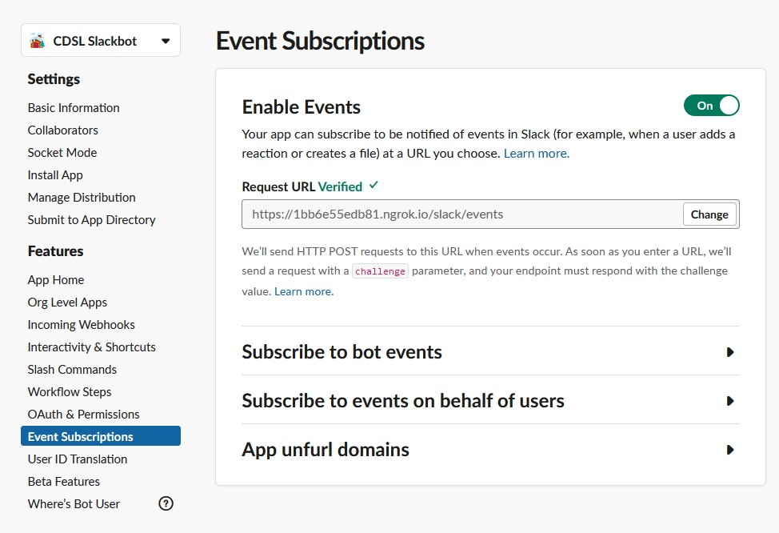

# slackbot

オリジナルなSlackbotを開発するぞ！

## 参考リンク

Guide [Slack | Bolt for Python](https://slack.dev/bolt-python/tutorial/getting-started)

Code [Bolt for Python](https://github.com/slackapi/bolt-python)

## 開発ガイド

### 環境

- Python 3.8.5
- WSL2 with Ubuntu 20.04
- ngrok 2.3.35

### 手順

venvをつくる．

```
python -m venv env
. env/bin/activate
```

packageをインストールする．

```
pip install -U pip
pip install -r requirements.txt
```

ngrokをインストールする．

https://ngrok.com/download

ngrokでポート転送を設定する．ローカルホストの3000/tcpをngrokで外部に公開する．

```
$ ngrok http 3000
ngrok by @inconshreveable
Session Status                online
Session Expires               1 hour, 51 minutes
Version                       2.3.35
Region                        United States (us)
Web Interface                 http://127.0.0.1:4040
Forwarding                    http://ac806888c053.ngrok.io -> http://localhost:3000
Forwarding                    https://ac806888c053.ngrok.io -> http://localhost:3000

Connections                   ttl     opn     rt1     rt5     p50     p90
                              1       0       0.00    0.00    0.01    0.01
HTTP Requests

POST /slack/events             200 OK 
```

環境変数を設定する．

```
export SLACK_BOT_TOKEN="xoxb-xxx"
export SLACK_SIGNING_SECRET="yyy"
```

SlackBotを以下のコマンドで起動する．

```
$ python app.py
INFO:slack_bolt.AsyncApp:⚡️ Bolt app is running!
DEBUG:asyncio:Using selector: EpollSelector
======== Running on http://0.0.0.0:3000 ========
(Press CTRL+C to quit)

# Open another tab
```

Slack APIの設定から `Event Subscriptions` を選び，`Enable Events` にあるRequest URLにngrokで表示されたForwardingのURL(例: `https://ac806888c053.ngrok.io`)を入力する．

[Slack APIの設定](https://api.slack.com/apps/A01LZEC2UG2/event-subscriptions)

